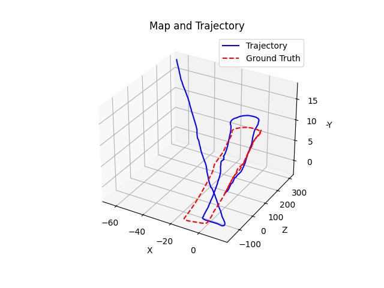
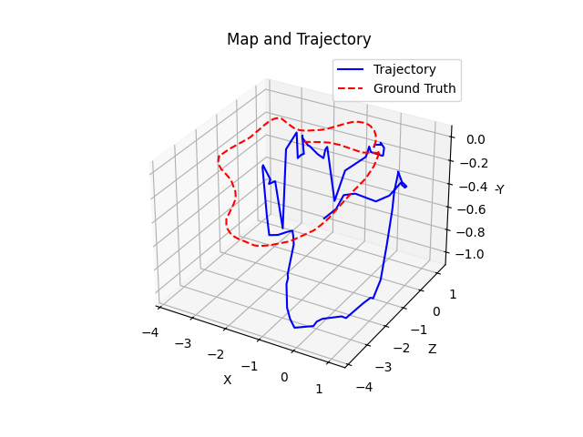

# VO

Simple Visual Odometry using ORB features.

**Note**: The only purpose of this repository is to study and get some experience with Visual Odometry and its variants, as a first step to understanding how modern vSLAM systems work.

## Monocular Visual Odometry on the KITTI Dataset

A simple 2D-2D Essential/Homography Matrix - based approach was used to calculate the trajectory in 2 Kitti scenes.

### 00

### 06

## RGB-D Visual Odometry on the TUM RGBD Dataset

A simple 3D-2D PnP - based approach was used to calculate the trajectory in one TUM RGB-D scene.

## Conclusion

The results indicate that this simple, bare-bones approach is not enough to provide accurate localization.
There is severe drift that makes the calculated trajectory deviate a lot from ground truth.

## Future Work

In the future, I plan to combine these 2 approaches to create a VO algorithm, which initializes a pose estimate using the Essential / Homography matrix and continues to estimate new poses using a local map and PnP.
An attempt on that already exists in the branch "orb".
The final goal is to create a vSLAM system that resembles ORB-SLAM.